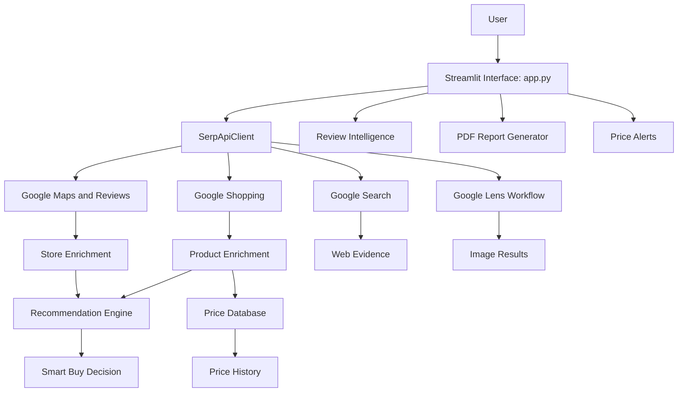

# 🛒 LocalPrice AI

### AI-Powered Shopping Intelligence & Price Comparison Platform

LocalPrice AI is a shopping intelligence platform that helps users compare online product prices, discover nearby stores, review product information, track price history, and make more informed purchasing decisions.

Built with Python, Streamlit, and SerpApi, the platform combines online shopping search, local business discovery, review analysis, web research, and rule-based recommendations in a single interface.

**Find better deals. Explore nearby stores. Make smarter buying decisions.**

---

## 📌 Table of Contents

- [Overview](#-overview)
- [Key Features](#-key-features)
- [How It Works](#-how-it-works)
- [Agents and Core Components](#-agents-and-core-components)
- [Technology Stack](#-technology-stack)
- [API Keys and Configuration](#-api-keys-and-configuration)
- [SerpApi Integration](#-serpapi-integration)
- [Installation and Setup](#-installation-and-setup)
- [How to Use](#-how-to-use)
- [Project Structure](#-project-structure)
- [System Architecture](#-system-architecture)
- [Data Storage](#-data-storage)
- [Security and Privacy](#-security-and-privacy)
- [Limitations](#-limitations)
- [Future Enhancements](#-future-enhancements)
- [Troubleshooting](#-troubleshooting)
- [Contributing](#-contributing)
- [License](#-license)

---

## 🌟 Overview

Finding the right product at the right price often requires checking multiple websites, comparing sellers, searching for nearby stores, and evaluating customer feedback.

LocalPrice AI simplifies this process by bringing these shopping research capabilities into one application.

Users can enter a product name, specify their location, set a budget, choose their recommendation priority, and explore available results through an interactive dashboard.

### Project Goals

- Simplify online price comparison.
- Help users discover relevant nearby stores.
- Present product information and available customer feedback.
- Support price-history tracking.
- Provide explainable, rule-based buying recommendations.
- Generate downloadable shopping analysis reports.

---

## ✨ Key Features

### 1. 💰 Online Price Comparison

- Search for products using Google Shopping results.
- Display product titles, sellers, prices, and available ratings.
- Show product links when valid URLs are available.
- Support budget-based product filtering.
- Help users compare available shopping results.

### 2. 📍 Nearby Store Discovery

- Search for relevant local stores using Google Maps results.
- Display available addresses, ratings, contact information, and opening-status information.
- Show website links when available.
- Support a configurable local search radius.

*Store prices may require direct confirmation with the seller.*

### 3. ⭐ Customer Review Intelligence

- Retrieve supported reviews for selected stores.
- Display available customer feedback.
- Summarize positive and negative keyword signals.

Review sentiment is based on simple keyword matching, not a trained sentiment-analysis model.

### 4. 📈 Price History

- Save product price snapshots locally.
- Retrieve historical records from the database.
- Display available price trends in a chart.
- Exclude invalid prices and extreme outliers from the displayed history.

Price history builds over time as searches are performed and valid snapshots are saved.

### 5. 🧠 Smart Buy Decision

The recommendation component evaluates available product and store information according to the selected priority.

Supported priorities include:

- Best Overall
- Cheapest
- Highest Rated
- Nearest
- Fastest Delivery

The recommendation logic is rule-based and depends on the available search-result data.

### 6. 📷 Product Image Search

- Upload a supported product image.
- Search for visually similar products through Google Lens-related functionality.
- Display available visual matches, prices, and result links.

### 7. 🌐 Web Evidence

- Retrieve supporting web search results.
- Display relevant titles, snippets, and source links.
- Help users investigate additional information before purchasing.

### 8. 🔔 Price Alerts

- Save a target price for a product.
- Display saved alert information.

**Current limitation:** Alerts are stored locally. Automatic email, WhatsApp, push notifications, and continuous background monitoring are not implemented.

### 9. 📄 PDF Reports

- Generate a downloadable shopping analysis report.
- Include available product, store, recommendation, and price-history information.

### 10. 🎯 Budget and Location Controls

- Enter a maximum budget.
- Specify a search location.
- Adjust the local search radius.
- Select a preferred recommendation strategy.

---

## 🔄 How It Works

1. **Enter a product:** The user specifies the product they want to find.
2. **Configure preferences:** The user enters a location, budget, search radius, and recommendation priority.
3. **Retrieve results:** The application requests relevant shopping, maps, and web search data.
4. **Process the results:** Product and store data are enriched and prepared for display.
5. **Save price snapshots:** Valid product prices are stored in the local database.
6. **Generate recommendations:** The recommendation component evaluates the available information.
7. **Explore the dashboard:** The user reviews prices, stores, customer feedback, price history, image matches, and web evidence.
8. **Export a report:** The user can generate a PDF report of the shopping analysis.

---

## 🤖 Agents and Core Components

LocalPrice AI uses task-specific components to organize shopping research. These components should not be confused with autonomous AI agents or independent large language models.

| Component | Responsibility | Main Implementation |
|---|---|---|
| Shopping Search | Retrieves online product listings and prices | `SerpApiClient` |
| Local Store Discovery | Retrieves nearby business information | `SerpApiClient` |
| Product Enrichment | Processes shopping results and applies budget-related filtering | `enrich_products()` |
| Store Enrichment | Processes local store results using the configured radius | `enrich_stores()` |
| Recommendation Engine | Produces a buying recommendation using available data and selected priorities | `build_recommendation()` |
| Review Intelligence | Retrieves and summarizes available review information | Streamlit application and review logic |
| Image Search | Uploads an image and retrieves supported visual search results | `SerpApiClient` |
| Web Research | Retrieves supporting web results | `SerpApiClient` |
| Price Tracking | Saves and retrieves historical price snapshots | `PriceDB` |
| Report Generation | Creates downloadable PDF reports | `create_pdf_report()` |

### Component Workflow

The main application coordinates these components and presents their outputs through the Streamlit interface.

The shopping and discovery components rely on external search APIs. Data processing, recommendation logic, database operations, and report generation are handled by the application's Python modules.

---

## 🧰 Technology Stack

| Technology | Purpose |
|---|---|
| Python | Application logic and data processing |
| Streamlit | Interactive web application and dashboard |
| SerpApi | Search-result retrieval |
| Pandas | Tabular data processing |
| SQLite or the database configured by `PriceDB` | Local price history and alert storage |
| HTML and CSS | Custom interface styling |
| PDF generation library used by `reports.py` | Report creation |
| Git and GitHub | Version control and source-code hosting |
| Streamlit Community Cloud | Optional application deployment |

The exact dependency versions are defined in `requirements.txt`. Database behavior and report-generation dependencies are defined by the corresponding source modules.

---

## 🔑 API Keys and Configuration

### Required API Key

LocalPrice AI requires a **SerpApi API key** to retrieve supported search results.

Create or obtain your key from:

https://serpapi.com/

### Option 1: Configure Using a `.env` File

Create a file named `.env` in the project root directory:

```env
SERPAPI_API_KEY=your_serpapi_api_key_here
```

Replace the placeholder with your actual key.

If you want the application to read `.env` automatically, ensure that `python-dotenv` is installed and loaded in the application before reading environment variables.

The current application reads the key from Streamlit Secrets or the operating-system environment. A `.env` file is not automatically loaded by Python unless the application or its startup process loads it.

### Option 2: Configure Using Environment Variables

**Windows PowerShell:**

```powershell
$env:SERPAPI_API_KEY="your_serpapi_api_key_here"
python -m streamlit run app.py
```

**Linux or macOS:**

```bash
export SERPAPI_API_KEY="your_serpapi_api_key_here"
python -m streamlit run app.py
```

### Option 3: Configure Streamlit Cloud

For a deployed application:

1. Open your app in Streamlit Community Cloud.
2. Open the app settings.
3. Find the **Secrets** section.
4. Add the following configuration:

```toml
SERPAPI_API_KEY = "your_serpapi_api_key_here"
```

5. Save the configuration and restart or rerun the app if required.

### Security Rules

- Never commit `.env` files or API keys to GitHub.
- Add `.env` to `.gitignore`.
- Use Streamlit Secrets for deployed applications.
- If a key is accidentally exposed, revoke or rotate it through the provider.
- Keep API keys out of source code, screenshots, logs, and public documentation.

---

## 🔎 SerpApi Integration

SerpApi supplies search-result data used by LocalPrice AI. The exact availability of fields depends on the search response and the provider's current API behavior.

| Search API / Feature | Purpose |
|---|---|
| Google Shopping | Retrieves online product listings, prices, sellers, and available product metadata |
| Google Maps | Discovers nearby businesses and local stores |
| Google Maps Reviews | Retrieves supported reviews for selected places |
| Google Search | Provides supporting web results and snippets |
| Google Lens | Supports product-image matching and visual search |
| Google Product | Can retrieve additional details for a supported shopping product identifier, if enabled by the client implementation |
| Image Upload | Supports the image-upload step required by the configured visual-search workflow |

The application wraps provider requests through `SerpApiClient`, keeping API communication separate from much of the dashboard presentation logic.

### Important Usage Notes

- Not every result contains a price, rating, review count, image, or direct product URL.
- Some API features may require specific request parameters or identifiers.
- API usage is subject to SerpApi plan limits, credits, pricing, and provider terms.
- Search-result prices and availability can change.
- Always verify the current implementation in `serpapi_client.py` before assuming a particular endpoint is enabled.

Official documentation:

- SerpApi: https://serpapi.com/
- Google Shopping API: https://serpapi.com/google-shopping-api
- Google Maps API: https://serpapi.com/google-maps-api
- Google Maps Reviews API: https://serpapi.com/google-maps-reviews-api
- Google Search API: https://serpapi.com/search-api
- Google Lens API: https://serpapi.com/google-lens-api
- Google Product API: https://serpapi.com/google-product-api

---

## ⚙️ Installation and Setup

### Prerequisites

Install the following before starting:

- Python 3.10 or a compatible version supported by your dependencies.
- pip, the Python package installer.
- A SerpApi API key.
- Git, if cloning the repository.

### Step 1: Clone the Repository

```bash
git clone https://github.com/n93501614-cloud/Local_Price_AI.git
cd Local_Price_AI
```

### Step 2: Create a Virtual Environment

**Windows:**

```powershell
python -m venv .venv
.venv\Scripts\Activate.ps1
```

If PowerShell blocks activation, use Command Prompt:

```cmd
.venv\Scripts\activate.bat
```

**Linux or macOS:**

```bash
python3 -m venv .venv
source .venv/bin/activate
```

### Step 3: Install Dependencies

```bash
python -m pip install --upgrade pip
pip install -r requirements.txt
```

### Step 4: Configure the API Key

Set `SERPAPI_API_KEY` using one of the methods described in [API Keys and Configuration](#-api-keys-and-configuration).

### Step 5: Run the Application

```bash
python -m streamlit run app.py
```

Streamlit will display a local URL, usually:

```text
http://localhost:8501
```

Open the URL in your browser.

---

## 🖥️ How to Use

1. Launch LocalPrice AI.
2. Enter a product name, such as a smartphone or laptop.
3. Enter the location where you want to find products or stores.
4. Set a maximum budget if needed.
5. Select a local search radius.
6. Choose a recommendation priority.
7. Click **Find Best Deals**.
8. Explore the dashboard tabs:
   - Online Prices
   - Nearby Stores
   - Reviews
   - Price History
   - AI Decision
   - Image Search
   - Web Evidence
   - Price Alerts
   - Report
9. Open available product or seller links to verify the listing.
10. Generate and download a PDF report when required.

Results depend on API availability, the search query, location, provider limits, and the fields returned by the provider.

---

## 📁 Project Structure

The following is the expected structure based on the main application modules. Confirm exact filenames against the current repository before adding or removing files.

```text
Local_Price_AI/
│
├── app.py
├── serpapi_client.py
├── scoring.py
├── database.py
├── reports.py
├── requirements.txt
├── README.md
├── .gitignore
├── .env                  # Local only; never commit
└── .streamlit/
    └── secrets.toml      # Optional local Streamlit secrets
```

### Module Responsibilities

| File | Responsibility |
|---|---|
| `app.py` | Streamlit interface, user inputs, search orchestration, tabs, and result display |
| `serpapi_client.py` | SerpApi requests for shopping, maps, reviews, web search, and image search |
| `scoring.py` | Product and store enrichment plus buying recommendation logic |
| `database.py` | Price-history snapshots and price-alert storage |
| `reports.py` | PDF report generation |
| `requirements.txt` | Python package dependencies |
| `.env` | Local environment variables; should not be committed |
| `.streamlit/secrets.toml` | Optional local Streamlit Secrets configuration |

Runtime database files may be created by the database implementation and may not exist in a fresh clone.

---

## 🏗️ System Architecture



### Architecture Principles

- **Modular design:** API communication, data processing, persistence, and reporting are separated into modules.
- **Single interface:** Users access the available capabilities through one Streamlit application.
- **External data retrieval:** Search information comes from SerpApi.
- **Explainable recommendations:** Buying decisions are produced using application-defined logic.
- **Local persistence:** Price snapshots and alerts are stored according to the database implementation.
- **Extensibility:** New search providers, scoring rules, and reporting features can be added as separate modules.

---

## 🗄️ Data Storage

The `PriceDB` component manages the application's price history and saved alerts.

### Price History

When valid product prices are available, the application saves snapshots containing information such as:

- Product query
- Product title
- Seller or source
- Price
- Product URL
- Product identifier, when available

The history view retrieves stored records and displays a chart of available prices over time.

### Price Alerts

Users can save target prices and view their saved alerts.

**Persistence note:** Local database files may not be preserved across some hosted deployment restarts or rebuilds. Production deployments should use persistent storage if long-term price history and alerts are required.

---

## 🔐 Security and Privacy

LocalPrice AI uses external APIs and may process product queries and location text to retrieve shopping results.

Recommended deployment practices:

- Store credentials in environment variables or Streamlit Secrets.
- Exclude secret files and local databases from version control where appropriate.
- Avoid logging credentials or sensitive configuration values.
- Validate external URLs before displaying links.
- Use dependency versions tested with the application.
- Review the privacy implications of sending queries and location information to external providers.

---

## ⚠️ Limitations

LocalPrice AI is designed to support shopping research, but its results should be verified before making a purchase.

- Product listings and prices depend on external search results.
- Direct product links may be missing or redirect to a seller's website.
- Nearby-store results may not include confirmed prices or current availability.
- Review analysis uses simple keyword signals.
- Recommendations depend on available data and configured scoring logic.
- Price history requires valid snapshots to have been saved.
- Price alerts currently do not provide automatic background notifications.
- Image search depends on the configured upload and visual-search workflow.
- API requests are subject to provider quotas, rate limits, and network availability.

---

## 🚀 Future Enhancements

Potential product-development directions include:

- Automated price-drop monitoring and notifications.
- Persistent cloud database support.
- Improved product matching across sellers.
- Historical price charts with more granular comparisons.
- Dedicated product-detail pages.
- More robust review sentiment analysis.
- Optional machine-learning-based recommendation models.
- User accounts and saved shopping lists.
- Caching, retries, and API usage monitoring.
- Automated tests and continuous integration.
- Containerized deployment and production observability.
- Additional shopping providers and regional marketplaces.

These are potential extensions, not claims about currently implemented functionality.

---

## 🛠️ Troubleshooting

### `SerpApi API key is not configured`

- Verify that `SERPAPI_API_KEY` is set correctly.
- Check Streamlit Secrets when running on Streamlit Community Cloud.
- Restart the application after changing environment configuration.

### `ModuleNotFoundError`

Activate your virtual environment and run:

```bash
pip install -r requirements.txt
```

### `streamlit` Is Not Recognized

Run Streamlit through Python:

```bash
python -m streamlit run app.py
```

### No Shopping Results

- Try a more specific product name.
- Check your SerpApi account and remaining request allowance.
- Confirm that the API request succeeded.
- Remember that not every result contains usable pricing information.

### No Price History

Search for products with valid prices and check again. Historical records are created as the application saves price snapshots.

### Product Link Unavailable

Some search results do not provide a valid product URL. Try another listing and verify the destination before purchasing.

---

## 🤝 Contributing

Contributions that improve reliability, usability, performance, and maintainability are welcome.

Suggested workflow:

1. Fork the repository.
2. Create a feature branch.
3. Make a focused change.
4. Test the application locally.
5. Submit a pull request describing the change and its impact.

Please avoid committing credentials, environment files, or private configuration.

---

## 📄 License

Choose and add an appropriate open-source license before distributing the project. Until a license is added to the repository, reuse and redistribution permissions should not be assumed.

---

## 🛒 Project Summary

**LocalPrice AI** brings together online shopping search, local store discovery, price tracking, review insights, product-image search, and explainable buying recommendations in a unified application.

The goal is to make shopping research more convenient, transparent, and data-informed.

**Built with Python, Streamlit, and SerpApi.**
